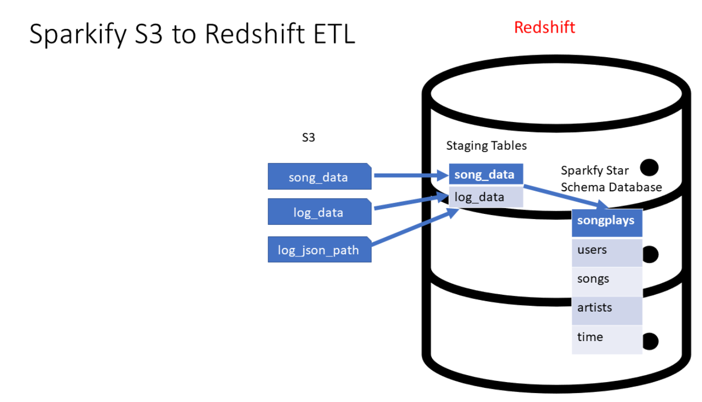
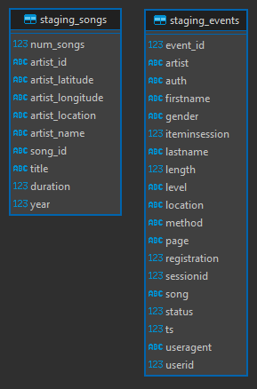
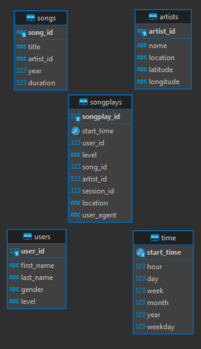

# 02 Cloud Data Warehouse

Author: [Daniel Caamal Herrera](https://www.linkedin.com/in/daniel-caamal-herrera/)

## Project: Data Warehouse

### Introduction

A music streaming startup, Sparkify, has grown their user base and song database and want to move their processes and data onto the cloud. Their data resides in S3, in a directory of JSON logs on user activity on the app, as well as a directory with JSON metadata on the songs in their app.

The task is to build an ETL pipeline that extracts their data from S3, stages them in Redshift, and transforms data into a set of dimensional tables for their analytics team to continue finding insights into what songs their users are listening to.


Source: [Udacity](https://www.udacity.com/)

### Project Description

Objective:

- Create a Redshift cluster
- Load data from S3 to staging tables on Redshift
- Execute SQL statements that create the analytics tables from these staging tables
- Build an complete ETL pipeline for a database hosted on Redshift.

#### Schema for Song Play Analysis

- Fact Table
  - songplays - records in event data associated with song plays i.e. records with page NextSong
    -songplay_id, start_time, user_id, level, song_id, artist_id, session_id, location, user_agent
- Dimension Tables
  - users - users in the app
    - user_id, first_name, last_name, gender, level
  - songs - songs in music database
    - song_id, title, artist_id, year, duration
  - artists - artists in music database
    - artist_id, name, location, latitude, longitude
  - time - timestamps of records in songplays broken down into specific units
    - start_time, hour, day, week, month, year, weekday

### Project Datasets

S3 (us-west-2) bucket: `s3://udacity-dend`

- Song data: `s3://udacity-dend/song_data`:
  - Is a subset of real data from the Million Song Dataset(opens in a new tab). Each file is in JSON format and contains metadata about a song and the artist of that song. The files are partitioned by the first three letters of each song's track ID. For example, here are file paths to two files in this dataset.

```
    song_data/A/B/C/TRABCEI128F424C983.json
    song_data/A/A/B/TRAABJL12903CDCF1A.json
```

Example:

```json
{
  "num_songs": 1,
  "artist_id": "ARJIE2Y1187B994AB7",
  "artist_latitude": null,
  "artist_longitude": null,
  "artist_location": "",
  "artist_name": "Line Renaud",
  "song_id": "SOUPIRU12A6D4FA1E1",
  "title": "Der Kleine Dompfaff",
  "duration": 152.92036,
  "year": 0
}
```

- Log data: `s3://udacity-dend/log_data`
  - Log data json path: `s3://udacity-dend/log_json_path.json`: It specifies the structure of the JSON data so that Redshift can properly parse and load it into the staging tables.
  - Consists of log files in JSON format generated by this event simulator(opens in a new tab) based on the songs in the dataset above. These simulate app activity logs from an imaginary music streaming app based on configuration settings, here are file paths to two files in this dataset

```
    log_data/2018/11/2018-11-12-events.json
    log_data/2018/11/2018-11-13-events.json
```

Example:

```json
{
  "artist": null,
  "auth": "Logged In",
  "firstName": "Celeste",
  "gender": "F",
  "itemInSession": 0,
  "lastName": "Williams",
  "length": null,
  "level": "free",
  "location": "Klamath Falls, OR",
  "method": "GET",
  "page": "Home",
  "registration": 1541077528796.0,
  "sessionId": 438,
  "song": null,
  "status": 200,
  "ts": 1541990258796,
  "userAgent": "\"Mozilla/5.0 (Windows NT 6.1; WOW64) AppleWebKit/537.36 (KHTML, like Gecko) Chrome/37.0.2062.103 Safari/537.36\"",
  "userId": "53"
}
```

### Project Setup

#### Prerequisites

Setup the following AWS services:

- IAM (To get the access key and secret key)
- S3 (To relate a role as Read-Only permission to the S3 bucket)
- Redshift (To create a Redshift cluster using the role ARN and the redshift endpoint)

Note: This could be done manually or using the AWS SDKs, examples could be found in the `utils` directory.

#### Configuration

- Modify the `dwh.cfg` file as follows:
  - Add the `HOST`, `DB_NAME`, `DB_USER`, `DB_PASSWORD` and the `DB_PORT` for the Redshift cluster in the `CLUSTER` section.
  - Add the `ARN` for the IAM role in the `IAM_ROLE` section.
  - Add the `LOG_DATA`, `LOG_JSONPATH`,`REGION` and `SONG_DATA` for the S3 bucket in the `S3` section.

Optionally (If using the AWS SDKs for local testing):

- Modify the `aws.cfg` file as follows:
  - Add the `IAM_KEY` and `IAM_SECRET` for the IAM user in the `IAM_MANAGEMENT` section.
  - Add the `IAM_ROLE_NAME` for the IAM role in the `IAM_MANAGEMENT` section.
  - Add the `DWH_ROLE_ARN`, `DWH_CLUSTER_TYPE`, `DWH_NUM_NODES`, `DWH_NODE_TYPE`, `DWH_CLUSTER_IDENTIFIER`, `DWH_DB`, `DWH_DB_USER`, `DWH_DB_PASSWORD` and `DWH_PORT` for the management of the Redshift cluster

### Project Structure

- _images:_ Contains the images used in the README.md
- _utils:_
  - cluster_management.py: Contains the code to create and delete the Redshift cluster
  - _get_args.py:_ Contains the code to get the command line arguments used in the cluster_management.py and iam_management.py
  - _iam_management.py:_ Contains the code to create and delete the IAM role
- _tests:_ Contains the test cases for the etl.py
- _create_tables.py:_ Contains the code to drop and recreate the tables in the Redshift cluster
- _dwh.cfg:_ Contains the configuration for the Redshift cluster and the S3 bucket
- _etl.py:_ Contains the code to extract, transform and load the data from the S3 bucket to the Redshift cluster
- _README.md:_ Contains the project documentation
- _requirements.txt:_ Contains the project dependencies
- _sql_queries.py:_ Contains the SQL queries used in the create_tables.py and etl.py for the Redshift cluster

### Project Execution

#### Step 0: Configure the dwh.cfg file

Do not forget to configure the `dwh.cfg` file with the necessary information for the Redshift cluster and the S3 bucket. (It could be done manually or using the AWS SDKs, examples could be found in the `utils` directory)

Ensure having the role ARN and the redshift endpoint to be used in the `dwh.cfg` file, otherwise, create a role and a Redshift cluster using the `utils/role_management.py` and `utils/cluster_management.py` scripts.
For this cases IAM_MANAGEMENT and CLUSTER_MANAGEMENT sections in the `aws.cfg` file should be configured.

```bash
$ python utils/role_management.py create
$ python utils/cluster_management.py create
```

#### Step 1: Install the project dependencies

Execute the following command to install the project dependencies

```bash
$ pip install -r requirements.txt
```

#### Step 2: Execute the create_tables.py script

To this point the sections `CLUSTER`, `S3` and `IAM_ROLE` in the `dwh.cfg` file are mandatory.

Execute the following command to create the tables in the Redshift cluster

```bash
$ python create_tables.py

Dropping tables
Creating tables
Tables dropped and created successfully
```

- It will drop the tables if they already exist.
- It will create the staging tables and the analytics tables in the Redshift cluster.

#### Step 3: Execute the etl.py script

Execute the following command to extract, transform and load the data from the S3 bucket to the Redshift cluster

```bash
$ python etl.py
```

- It will load the data from the S3 bucket to the staging tables in the Redshift cluster.
- It will execute the SQL statements that create the analytics tables from these staging tables.

At the end of the execution the test query count of each table is printed in the console output.

To execute the test cases for the etl.py script, execute the following command

```bash
$ python tests/test_etl.py
```

#### Step 4: Delete the Redshift cluster and the IAM role

To delete the Redshift cluster and the IAM role, it could be done manually or using the AWS SDKs, examples could be found in the `utils` directory.

To delete the resources execute the following commands

```bash
$ python utils/cluster_management.py delete
$ python utils/role_management.py delete
```

### Project expected output

Example output from the execution

```bash
$ python create_tables.py

Loading staging tables
Inserting tables
            table  count
0  staging_events   8056
1   staging_songs  14896
2       songplays   9957
3           users    104
4           songs  14896
5         artists  10025
6            time   6813
ETL process completed

```

### Project results

#### Initial considerations

- Every table has a primary key, for the case of the redshift cluster, the primary key is also the sort key.
- The "basic" or "classic" varchar has the length of 255 characters (No more needed for this datasets, and also each column could be configured with less).

##### Staging Tables configuration

The staging tables are used to get the data from the S3 bucket to the Redshift cluster.

- The IDENTITY(0,1) is used as serial for the primary key in the staging tables.

The staging tables are:

- staging_events:
  - The primary key is the event_id.
  - Only the event_id and the ts are bigints, the other columns are varchar(255), float, integers.
  - Only the event_id is not null.
  - The gender is a varchar(1).
  - The copy command includes the FORMAT AS JSON 's3://udacity-dend/log_json_path.json' to parse the JSON data.
- staging_songs
  - There is not special columns types, all are varchar(255), float, integers.
  - For the case of artist_id and song_id are not null and the length is limited to 18 characters.
  - The sort key is ths song_id.
  - The dist key is the artist_id.
  - The copy command includes the FORMAT AS JSON 'auto' to parse the JSON data.
  - The copy command includes the ACCEPTINVCHARS to accept the invalid characters in the JSON data.



##### Data Model (Star Schema) configuration

The data model is a star schema with the following tables:

- songplays (Fact Table):

  - The primary key is the songplay_id.
  - The start_time is a TIMESTAMP, and is calculated as: `TIMESTAMP 'epoch' + ts/1000 * interval '1 second'`.
  - For the case of artist_id and song_id are not null and the length is limited to 18 characters.

- songs (Dimension Table):
  - The primary key is the song_id and is not null (The song_id is a varchar(18)).
  - The artist_id is a varchar(18), and is not null.
- artists (Dimension Table)
  - The primary key is the artist_id and is not null (The artist_id is a varchar(18)).
  - The latitude and longitude are varchars, but also could be floats.
- users (Dimension Table)
  - The primary key is the user_id and is not null, is an integer.
  - The gender is a varchar(1).
- time (Dimension Table)
  - The primary key is the start_time, and is not null, is a TIMESTAMP and is calculated as: `TIMESTAMP 'epoch' + ts/1000 * interval '1 second'`.
  - The hour, day, week, month, year and weekday are integers calculated from the start_time (The start_time is a TIMESTAMP).



### Summary

This project is interesting because even with the project instructions it was a challenge to get with the data model right and to get the data from the S3 bucket to the Redshift cluster. The table pg_catalog.stl_load_errors was very useful to get the errors in the COPY command (the course material needs to be updated with this information).

The principal challenges were:

- To get the data model right, and to get the data from the S3 bucket to the Redshift cluster.
- To adapt the SQL statements to the Redshift syntax.
- To get the exact SQL statements to create the analytics tables from the staging tables.
- To get the exact SQL statements to insert the data from the staging tables to the analytics tables.

### Project improvements

1. The `etl.py` script could be improved to handle the case when the data is already loaded in the Redshift cluster.
2. the presentation of the data is the most important part of the project, and here is just a table with counts, that could be improved.
