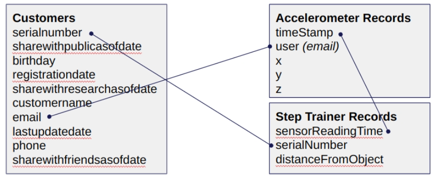
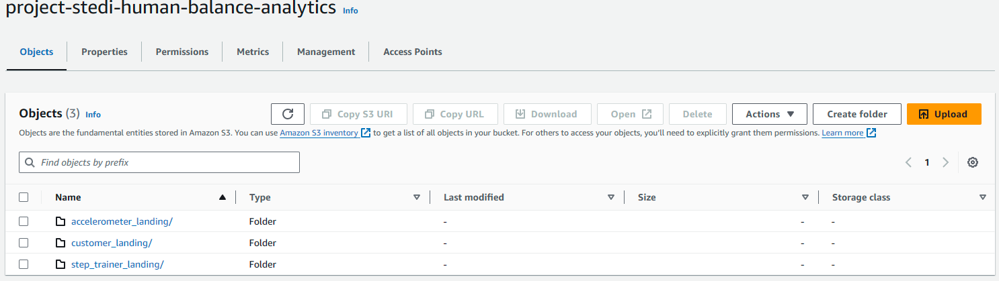

# Project: STEDI Human Balance Analytics

## Overview

To simulate the data coming from the various sources, you will need to create your own S3 directories for customer_landing, step_trainer_landing, and accelerometer_landing zones, and copy the data there as a starting point.

1. You have decided you want to get a feel for the data you are dealing with in a semi-structured format, so you decide to create two Glue tables for the two landing zones. Share your customer_landing.sql and your accelerometer_landing.sql script in git.

2. Query those tables using Athena, and take a screenshot of each one showing the resulting data. Name the screenshots customer_landing(.png,.jpeg, etc.) and accelerometer_landing(.png,.jpeg, etc.).

The Data Science team has done some preliminary data analysis and determined that the Accelerometer Records each match one of the Customer Records. They would like you to create 2 AWS Glue Jobs that do the following:

3. Sanitize the Customer data from the Website (Landing Zone) and only store the Customer Records who agreed to share their data for research purposes (Trusted Zone) - creating a Glue Table called customer_trusted.
4. Sanitize the Accelerometer data from the Mobile App (Landing Zone) - and only store Accelerometer Readings from customers who agreed to share their data for research purposes (Trusted Zone) - creating a Glue Table called accelerometer_trusted.
5. You need to verify your Glue job is successful and only contains Customer Records from people who agreed to share their data. Query your Glue customer_trusted table with Athena and take a screenshot of the data. Name the screenshot customer_trusted(.png,.jpeg, etc.).

Data Scientists have discovered a data quality issue with the Customer Data. The serial number should be a unique identifier for the STEDI Step Trainer they purchased. However, there was a defect in the fulfillment website, and it used the same 30 serial numbers over and over again for millions of customers! Most customers have not received their Step Trainers yet, but those who have, are submitting Step Trainer data over the IoT network (Landing Zone). The data from the Step Trainer Records has the correct serial numbers.
The problem is that because of this serial number bug in the fulfillment data (Landing Zone), we don’t know which customer the Step Trainer Records data belongs to.
The Data Science team would like you to write a Glue job that does the following:

6. Sanitize the Customer data (Trusted Zone) and create a Glue Table (Curated Zone) that only includes customers who have accelerometer data and have agreed to share their data for research called customers_curated.

Finally, you need to create two Glue Studio jobs that do the following tasks:

7. Read the Step Trainer IoT data stream (S3) and populate a Trusted Zone Glue Table called step_trainer_trusted that contains the Step Trainer Records data for customers who have accelerometer data and have agreed to share their data for research (customers_curated).
8. Create an aggregated table that has each of the Step Trainer Readings, and the associated accelerometer reading data for the same timestamp, but only for customers who have agreed to share their data, and make a glue table called machine_learning_curated.

Refer to the relationship diagram below to understand the desired state.


### Expected Results

You should have the following number of rows in each table:

- Landing
  - Customer: 956
  - Accelerometer: 81273
  - Step Trainer: 28680
- Trusted
  - Customer: 482
  - Accelerometer: 40981
  - Step Trainer: 14460
- Curated
  - Customer: 482
  - Machine Learning: 43681

## Project setup

Create an S3 bucket and upload the data files to the bucket.

```bash
# Create a Trusted Zone in AWS-Glue - S3
aws s3 mb s3://project-stedi-human-balance-analytics

# Create a VPC endpoint for S3
aws ec2 create-vpc-endpoint --vpc-id ___ --service-name com.amazonaws.us-east-1.s3 --route-table-ids ___

# Create a role for Glue
aws iam create-role --role-name my-glue-service-role --assume-role-policy-document '{
    "Version": "2012-10-17",
    "Statement": [
        {
            "Effect": "Allow",
            "Principal": {
                "Service": "glue.amazonaws.com"
            },
            "Action": "sts:AssumeRole"
        }
    ]
}'


# Attach policies to the role for S3
aws iam put-role-policy --role-name my-glue-service-role --policy-name S3Access --policy-document '{ "Version": "2012-10-17", "Statement": [ { "Sid": "ListObjectsInBucket", "Effect": "Allow", "Action": [ "s3:ListBucket" ], "Resource": [ "arn:aws:s3:::project-stedi-human-balance-analytics" ] }, { "Sid": "AllObjectActions", "Effect": "Allow", "Action": "s3:*Object", "Resource": [ "arn:aws:s3:::project-stedi-human-balance-analytics/*" ] } ] }'

# Attach policies to the role for Glue
aws iam put-role-policy --role-name my-glue-service-role --policy-name GlueAccess --policy-document '{
    "Version": "2012-10-17",
    "Statement": [
        {
            "Effect": "Allow",
            "Action": [
                "glue:*",
                "s3:GetBucketLocation",
                "s3:ListBucket",
                "s3:ListAllMyBuckets",
                "s3:GetBucketAcl",
                "ec2:DescribeVpcEndpoints",
                "ec2:DescribeRouteTables",
                "ec2:CreateNetworkInterface",
                "ec2:DeleteNetworkInterface",
                "ec2:DescribeNetworkInterfaces",
                "ec2:DescribeSecurityGroups",
                "ec2:DescribeSubnets",
                "ec2:DescribeVpcAttribute",
                "iam:ListRolePolicies",
                "iam:GetRole",
                "iam:GetRolePolicy",
                "cloudwatch:PutMetricData"
            ],
            "Resource": [
                "*"
            ]
        },
        {
            "Effect": "Allow",
            "Action": [
                "s3:CreateBucket",
                "s3:PutBucketPublicAccessBlock"
            ],
            "Resource": [
                "arn:aws:s3:::aws-glue-*"
            ]
        },
        {
            "Effect": "Allow",
            "Action": [
                "s3:GetObject",
                "s3:PutObject",
                "s3:DeleteObject"
            ],
            "Resource": [
                "arn:aws:s3:::aws-glue-*/*",
                "arn:aws:s3:::*/*aws-glue-*/*"
            ]
        },
        {
            "Effect": "Allow",
            "Action": [
                "s3:GetObject"
            ],
            "Resource": [
                "arn:aws:s3:::crawler-public*",
                "arn:aws:s3:::aws-glue-*"
            ]
        },
        {
            "Effect": "Allow",
            "Action": [
                "logs:CreateLogGroup",
                "logs:CreateLogStream",
                "logs:PutLogEvents",
                "logs:AssociateKmsKey"
            ],
            "Resource": [
                "arn:aws:logs:*:*:/aws-glue/*"
            ]
        },
        {
            "Effect": "Allow",
            "Action": [
                "ec2:CreateTags",
                "ec2:DeleteTags"
            ],
            "Condition": {
                "ForAllValues:StringEquals": {
                    "aws:TagKeys": [
                        "aws-glue-service-resource"
                    ]
                }
            },
            "Resource": [
                "arn:aws:ec2:*:*:network-interface/*",
                "arn:aws:ec2:*:*:security-group/*",
                "arn:aws:ec2:*:*:instance/*"
            ]
        }
    ]
}'

# Clone the repository
git clone https://github.com/udacity/nd027-Data-Engineering-Data-Lakes-AWS-Exercises.git

# Copy the project files into the project directory
aws s3 cp ./nd027-Data-Engineering-Data-Lakes-AWS-Exercises/project/starter/accelerometer/landing s3://project-stedi-human-balance-analytics/accelerometer_landing --recursive

aws s3 cp ./nd027-Data-Engineering-Data-Lakes-AWS-Exercises/project/starter/customer/landing s3://project-stedi-human-balance-analytics/customer_landing --recursive

aws s3 cp ./nd027-Data-Engineering-Data-Lakes-AWS-Exercises/project/starter/step_trainer/landing s3://project-stedi-human-balance-analytics/step_trainer_landing --recursive
```

You should have the following directory and files in the S3 bucket:


## Project checklist

### Landing Zone

#### Use Glue Studio to ingest data from an S3 bucket

customer_landing_to_trusted.py, accelerometer_landing_to_trusted.py, and step_trainer_trusted.py Glue jobs have a node that connects to S3 bucket for customer, accelerometer, and step trainer landing zones.

- [customer_landing_to_trusted.py](./trusted-zone/glue-scripts/customer_landing_to_trusted.py)
- [accelerometer_landing_to_trusted.py](./trusted-zone/glue-scripts/accelerometer_landing_to_trusted.py)
- [step_trainer_trusted.py](./trusted-zone/glue-scripts/step_trainer_trusted.py)

#### Manually create a Glue Table using Glue Console from JSON data

SQL DDL scripts customer_landing.sql, accelerometer_landing.sql, and step_trainer_landing.sql include all of the JSON fields in the data input files and are appropriately typed (not everything is a string).

- [customer_landing.sql](./landing-zone/sql-ddl-scripts/customer_landing.sql)
- [accelerometer_landing.sql](./landing-zone/sql-ddl-scripts/accelerometer_landing.sql)
- [step_trainer_landing.sql](./landing-zone/sql-ddl-scripts/step_trainer_landing.sql)

#### Use Athena to query the Landing Zone.

Include screenshots showing various queries run on Athena, along with their results:

- Count of customer_landing: 956 rows
  - [customer_landing.png](./landing-zone/screenshots/customer_landing.png)
- The customer_landing data contains multiple rows with a blank - shareWithResearchAsOfDate.
  - [customer_landing_shareWithResearchAsOfDate.png](./landing-zone/screenshots/customer_landing_shareWithResearchAsOfDate.png)
- Count of accelerometer_landing: 81273 rows
  - [accelerometer_landing.png](./landing-zone/screenshots/accelerometer_landing.png)
- Count of step_trainer_landing: 28680 rows
  - [step_trainer_landing.png](./landing-zone/screenshots/step_trainer_landing.png)

### Trusted Zone

#### Configure Glue Studio to dynamically update a Glue Table schema from JSON data

Glue Job Python code shows that the option to dynamically infer and update schema is enabled.

To do this, set the Create a table in the Data Catalog and, on subsequent runs, update the schema and add new partitions option to True.

#### Use Athena to query Trusted Glue Tables

Include screenshots showing various queries run on Athena, along with their results:

- Count of customer_trusted: 482 rows
  - [customer_trusted.png](./trusted-zone/screenshots/customer_trusted.png)
- The resulting customer_trusted data has no rows where shareWithResearchAsOfDate is blank.
  - [customer_trusted_shareWithResearchAsOfDate.png](./trusted-zone/screenshots/customer_trusted_shareWithResearchAsOfDate.png)
- Count of accelerometer_trusted: 40981 rows
  - [accelerometer_trusted.png](./trusted-zone/screenshots/accelerometer_trusted.png)
- Count of step_trainer_trusted: 14460 rows
  - [step_trainer_trusted.png](./trusted-zone/screenshots/step_trainer_trusted.png)

#### Filter protected PII with Spark in Glue Jobs

customer_landing_to_trusted.py has a node that drops rows that do not have data in the sharedWithResearchAsOfDate column.

- [customer_landing_to_trusted.py](./trusted-zone/glue-scripts/customer_landing_to_trusted.py)

Hints:

- Transform - SQL Query node often gives more consistent outputs than other node types.
- Glue Jobs do not replace any file. Delete your S3 files and Athena table whenever you update your visual ETLs.

#### Join Privacy tables with Glue Jobs

accelerometer_landing_to_trusted.py has a node that inner joins the customer_trusted data with the accelerometer_landing data by emails. The produced table should have only columns from the accelerometer table.

- [accelerometer_landing_to_trusted.py](./trusted-zone/glue-scripts/accelerometer_landing_to_trusted.py)

### Curated Zone

#### Write a Glue Job to join trusted data

customer_trusted_to_curated.py has a node that inner joins the customer_trusted data with the accelerometer_trusted data by emails. The produced table should have only columns from the customer table.

- [customer_trusted_to_curated.py](./curated-zone/glue-scripts/customer_trusted_to_curated.py)

#### Write a Glue Job to create curated data

step_trainer_trusted.py has a node that inner joins the step_trainer_landing data with the customer_curated data by serial numbers

- [step_trainer_trusted.py](./trusted-zone/glue-scripts/step_trainer_trusted.py)

machine_learning_curated.py has a node that inner joins the step_trainer_trusted data with the accelerometer_trusted data by sensor reading time and timestamps

- [machine_learning_curated.py](./curated-zone/glue-scripts/machine_learning_curated.py)

Hints:

- Data Source - S3 bucket node sometimes extracted incomplete data. Use the Data Source - Data Catalog node when that's the case.
- Use the Data Preview feature with at least 500 rows to ensure the number of customer-curated rows is correct. Click "Start data preview session", then click the gear next to the "Filter" text box to update the number of rows
- As before, the Transform - SQL Query node often gives more consistent outputs than any other node type. Tip - replace the JOIN node with it.
- The step_trainer_trusted may take about 8 minutes to run.

#### Use Athena to query Curated Glue Tables

Include screenshots showing various queries run on Athena, along with their results:

- Count of customer_curated: 482 rows
  - [customer_curated.png](./curated-zone/screenshots/customer_curated.png)
- Count of machine_learning_curated: 43681 rows
  - [machine_learning_curated.png](./curated-zone/screenshots/machine_learning_curated.png)

Hint: If you retrieve too many rows, consider dropping duplicates using the Transform - SQL Query node with the SELECT DISTINCT query.
