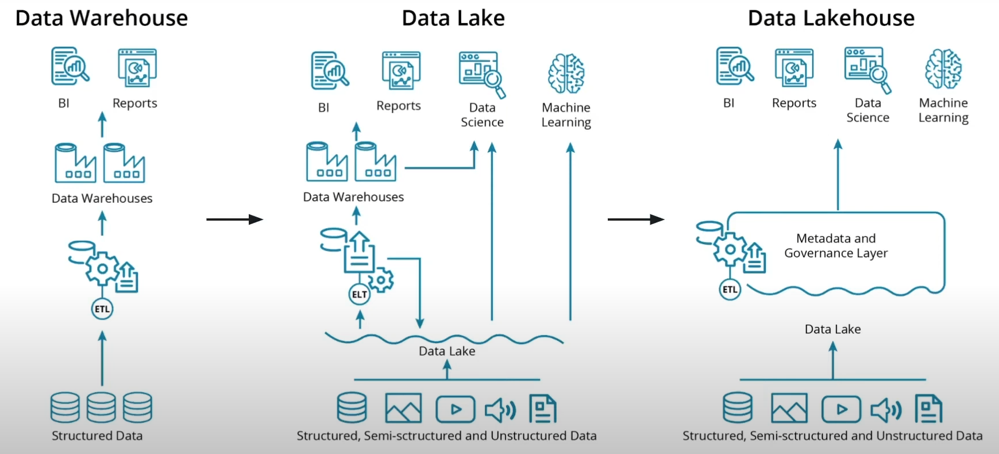

# Data engineering with AWS

Nanodegree data engineering lessons from Udacity

## Topics

- [Data Modeling](#01---data-modeling)
  - [Introduction to Data Modeling](#introduction-to-data-modeling)
    - [What is a Data Model?](#what-is-a-data-model)
      - [What is Data Modeling?](#what-is-data-modeling)
      - [Why Data Modeling is important?](#why-data-modeling-is-important)
      - [Who does Data Modeling?](#who-does-data-modeling)
    - [Introduction to Relational Databases](#introduction-to-relational-databases)
      - [What is a Relational Model?](#what-is-a-relational-model)
      - [What is a Relational Database?](#what-is-a-relational-database)
      - [Advantages of Relational Databases](#advantages-of-relational-databases)
      - [Disadvantages of Relational Databases](#disadvantages-of-relational-databases)
      - [Introduction to PostgreSQL](#introduction-to-postgresql)
    - [Introduction to NoSQL Databases](#introduction-to-nosql-databases)
      - [What is not relational databases?](#what-is-not-relational-databases)
      - [Advantages of NoSQL Databases](#advantages-of-nosql-databases)
      - [Disadvantages of NoSQL Databases](#disadvantages-of-nosql-databases)
      - [Introduction to Apache Cassandra](#introduction-to-apache-cassandra)
    - [Remember SQL vs NoSQL](#remember-sql-vs-nosql)
  - [Modeling relational databases](#modeling-relational-databases)
    - [Importance of Relational Databases](#importance-of-relational-databases)
    - [Online Analytical Processing (OLAP) vs Online Transactional Processing (OLTP)](#online-analytical-processing-olap-vs-online-transactional-processing-oltp)
    - [Normalization and Denormalization](#normalization-and-denormalization)
    - [Fact and Dimension Tables](#fact-and-dimension-tables)
      - [Star Schema and Snowflake Schema](#star-schema-and-snowflake-schema)
  - [No Sql Data Models](#no-sql-data-models)
    - [Importance of NoSQL Databases](#importance-of-nosql-databases-1)
    - [The CAP Theorem](#the-cap-theorem)
    - [Apache Cassandra](#apache-cassandra)
      - [CQL](#cql)
      - [Primary Key](#primary-key)
      - [Clustering Columns](#clustering-columns)
      - [Where Clause](#where-clause)

## 01 - Data Modeling

### Introduction to Data Modeling

#### What is a Data Model?

- Is a abstraction that organizes elements of data and how they will relate to each other.

##### What is Data Modeling?

- Is the process of creating data models for a information system to support business and user applications.
- Data modeling can easily translate to database modeling.
- Steps to create a data model:
  - Gather requirements
  - Conceptual data modeling (Entity mapping)
  - Logical data modeling (Tables, columns, relationships)
  - Physical data modeling (The creation of DDL'S - Data Definition Language)

##### Why Data Modeling is important?

- Data organization is critical
- Use cases are easier to implement
- Organized data determines later data use
- Starting early
- Iterative process, having flexibility will help as new information becomes available

##### Who does Data Modeling?

- Data scientists
- Data engineers
- Software engineers
- Product owners
- Business analysts

#### Introduction to Relational Databases

##### What is a Relational Model?

- Model that organizes dta into one or more tables (or "relations") of columns and rows, with a unique key identifying each row.

##### What is a Relational Database?

- Is a digital Database base on the relational model of data.
- The RDBMS (Relational Database Management System) is the software that manages the relational database.
- SQL (Structured Query Language) is the language used across almost all relational database system for querying and maintaining the database.
- Common Relational Databases:
  - PostgreSQL
  - MySQL
  - SQLite
  - Oracle
  - SQL Server
- The structures:
  - Database/Schema: A collection of tables (Database)
  - Table: A collection of rows and columns (Entity)
  - Columns/Attributes: A column in a table (Single Field)
  - Rows/Tuples: A row in a table (Single Item)

##### Advantages of Relational Databases

- Easy of use
- Ability to do JOINS
- Ability to do Aggregations
- Smaller data volumes
- Easier to change business requirements
- Flexibility for queries
- Modeling the data not modeling the queries
- Secondary indexes
- ACID transactions (Atomicity, Consistency, Isolation, Durability):
  - Atomicity: All or nothing
  - Consistency: The data should be correct across all rows and tables.
  - Isolation: Operations do not interfere with each other
  - Durability: Once a transaction is committed, it will remain so

##### Disadvantages of Relational Databases

- Large amounts of data
- Need to be able to store different data types
- Need to high throughput --fast reads
- Need a flexible schema
- Need high availability: 24/7
- Need horizontal scaling: ability to add more servers

##### Introduction to PostgreSQL

Is an open-source object-relational database system that uses and extends the SQL language.

#### Introduction to NoSQL Databases

##### What is not relational databases?

- Databases which simpler design and horizontal scaling.
- Data structures are different than relational databases and are more flexible and faster.
- Common types of NoSQL databases:
  - Document databases: Store data in documents (MongoDB)
  - Partition row store: Wide-column stores (Cassandra)
  - Wide-column stores: Store data in tables, rows, and dynamic columns (Apache HBase)
  - Key-value stores: Data is stored in a schema-less way, and there is no need for a fixed schema (DynamoDB)
  - Graph databases: Data is saved in graph structures with nodes, edges, and properties (Neo4j)
- Common Non Relational Databases:
  - MongoDB
  - Cassandra
  - HBase
  - DynamoDB
  - Neo4j

##### Advantages of NoSQL Databases

- Need to be able to store different data types
- Large amounts of data
- Need horizontal scaling
- Need high throughput --fast reads
- Need high availability: 24/7
- Users are distributed geographically: Multi-region, low latency

##### Disadvantages of NoSQL Databases

- Need ACID transactions
- Need to ability to do JOINS
- Ability to do aggregations and analytics
- Have changing business requirements
- Need to be able to do complex queries
- Have a smaller data volume

##### Introduction to Apache Cassandra

Is a free and open-source, distributed, wide column store, NoSQL database management system designed to handle large amounts of data across many commodity servers, providing high availability with no single point of failure.

- Own query language: CQL (Cassandra Query Language)
- The structures:
  - Keyspace: The outermost container for data in Cassandra (Collection of tables)
  - Table: A collection of rows that contain a sorted map of columns
  - Row: A collection of columns
  - Column: A key-value pair
  - Primary Key: A unique identifier for a row
  - Partition Key: The first part of a primary key
  - Clustering Column: The second part of a primary key
  - Data Column: The actual data

#### Remember SQL vs NoSQL

NoSQL databases and Relational Databases do not replace each other for all tasks. Both do different tasks extremely well, and should be used for the use cases they fit best.

### Modeling relational databases

#### Importance of Relational Databases

- Standardization of data model: The data model is the same across all tables.
- Flexibility in adding and altering tables: You can add new tables and columns to accommodate new types of data.
- Data Integrity: The data is correct and consistent across the database.
- Structured Query Language (SQL): The ability to do ad-hoc queries.
- Simplicity: The structure is simple and easy to understand.
- Intuitive Organization: The data is organized in tables.

#### Online Analytical Processing (OLAP) vs Online Transactional Processing (OLTP)

- OLAP: These type of databases are optimized for reads
- OLTP: These type of databases are optimized for writes, inserts, updates and deletes.

#### Normalization and Denormalization

- Normalization: To reduce data redundancy and increase data integrity.
  - Objetives:
    - To free the database from unwanted insertions, updates, and deletion dependencies.
    - To reduce the need for refactoring the database as new types of data are introduced.
    - To make the relational model more informative to users.
    - To make the database neutral to the query statistics.
  - Normal Forms:
    - First Normal Form (1NF):
      - Atomic values: Each cell contains unique and single values.
      - Be able to add data without altering tables.
      - Separate different relation into different tables.
      - Keep relationships between tables together with foreign keys.
    - Second Normal Form (2NF):
      - Have reached 1NF.
      - All columns in the table must rely on the primary key.
    - Third Normal Form (3NF):
      - Have reached 2NF.
      - No transitive dependencies.
- Denormalization: To increase read performance.
  - Objetives:
    - To speed up reads.
    - To add redundant copies of the data.
    - To avoid expensive joins.
    - To avoid complex joins.
    - To avoid slow write performance.
  - Denormalization comes after normalization.

#### Fact and Dimension Tables

- Dimension tables: Contains the data about the business.
  - Examples:
    - Users
    - Products
    - Time
- Fact tables: Provides the metric of the business process.
  - Examples:
    - Sales
    - Revenue
    - Costs

Example:

Source: [Data Engineering with AWS - Udacity](https://learn.udacity.com/nanodegrees/nd027)

##### Star Schema and Snowflake Schema

- Star Schema: A fact table in the middle connected to dimension tables.
  - Benefits:
    - Denormalized
    - Simplified queries
    - Fast aggregations
  - Drawbacks:
    - Data redundancy
    - Data integrity
    - Query performance and query complexity
    - Many to many relationships


Source: [Data Engineering with AWS - Udacity](https://learn.udacity.com/nanodegrees/nd027)

- Snowflake Schema: A fact table in the middle connected to dimension tables, which are connected to other dimension tables.
  - Star Schema is a special, simplified case of the Snowflake Schema.
  - Snowflake is more normalized than Star Schema, but only in 1NF or 2NF.

### No Sql Data Models

#### Importance of NoSQL Databases

- Need of high availability in the data
- Having large amounts of data
- Need of linear horizontal scaling
- Low latency and high throughput
- Need of fast reads and writes
- Eventual consistency is acceptable: The data will be consistent eventually, but not right away.

#### The CAP Theorem

- Consistency: Every read receives the most recent write or an error.
- Availability: Every request receives a response, without the guarantee that it contains the most recent write.
- Partition Tolerance: The system continues to operate despite an arbitrary number of messages being dropped (or delayed) by the network between nodes.

Note: There is no such thing as Consistency and Availability at the same time, in a distributed system it must always tolerate networks issues, so you can only choose between Consistency (CP) and Availability (AP).


#### Apache Cassandra

- Denormalization is not just a Ok, it's a must.
- Denormalization must be done for fast reads.
- Apache Cassandra has been optimized for fast writes.
- Always think queries first.
- One table per query is a great strategy.
- Apache Cassandra does not allow for JOINs between tables.

##### CQL

Cassandra Query Language (CQL) is a query language for the Apache Cassandra database. It is a close relative of SQL.

- Joins, group by, subqueries are not allowed.

##### Primary Key

- Must be unique
- Is made up of either just the partition key or composite of the partition key and clustering columns.
- The partition key will determine the distribution of data across the system.
- The clustering columns will sort the data in sorted order.
- The primary key is made up of the partition key and clustering columns.

##### Clustering Columns

- More than one clustering column can be added.
- The clustering columns will sort the data in sorted order.

##### Where Clause

- Data modeling in Apache Cassandra is query focused, and that focus needs to be on the WHERE clause.
- The WHERE clause is how you will be accessing your data, and is very important to get right.
- The partition key will be used in the WHERE clause.
- It is possible to do a query without a WHERE clause, but it is not recommended (ALLOW FILTERING).

## 02 - Cloud Data Warehouses

### Introduction to Data Warehouses

- Data Warehouse is a system that enables us to support analytical processes:
  - Reporting
  - Data Analysis
  - Business Intelligence
  - Decision Making
- A copy of transaction data specifically structured for query and analysis.

#### Data Warehouse Architecture: Kimball Bus Architecture

- Results in common dimension data model shared by different departments.
- Data is not kept as the aggregate level, but at the atomic level.
- Organized by business process, and used by different departments.

##### ETL

- Extract: Get data from different sources, transfer data to the data warehouse. Normally as regularly batch jobs. (Query #3NF DB)
- Transform: Clean, aggregate, and transform data. (Join tables, change data types, add columns, etc.)
- Load: Load data into the data warehouse. Structured into the dimensional data model. (Query #Star Schema)

### ETL and Dimensional Modeling

#### Steps to create a Data Warehouse

- Step 1: Define the data warehouse requirements: What are the business processes? What are the measurements?
- Step 2: Explore the 3NF database: What are the tables? What are the columns?
- Step 3: Insights from the 3NF database: What are the business processes? What are the measurements?
- Step 4: Create facts and dimensions tables: What are the facts? What are the dimensions?
  - Fact tables:
    - Record business events
    - Record measurements
  - Dimension tables:
    - Record business entities
    - Record business processes
    - Record business measurements
- Step 5: ETL the data from 3NF tables to Facts & Dimension Tables: What are the ETL processes?
- step 6: Create the OLAP cubes: What are the OLAP cubes?
  - OLAP (Online Analytical Processing) cubes are a way to pre-aggregate data for quick queries.
    - Roll-up: Grouping data from one dimension, stepping up the level of aggregation to a large grouping (e.g. summing up sales by month)
    - Drill-down: Breaking data down into more detail (e.g. breaking sales by month into sales by day)
    - Slice: Selecting a single dimension and viewing all of its data, reduce N to N - 1 dimensiones (e.g. viewing all sales by month)
    - Dice: Selecting two or more dimensions and viewing all of their data (e.g. viewing all sales by month and product)
  - Grouping sets:
    - Group by CUBE(dim1, dim2, ...) produces all combinations of grouping sets.
    - Group by CUBE statement do not pass through the facts table and aggregate all possible combinations of the dimensions.

### Introduction to Cloud Data Warehouses

#### Cloud Data Warehouses Storages

SQL

- AWS
  - Amazon RDS (MySQL, PostgreSQL, MariaDB, Oracle, MS SQL Server)
  - Amazon Aurora (MySQL, PostgreSQL)
- Azure
  - Azure SQL Database (MS SQL Server)
  - Azure Database for MySQL
  - Azure Database for MariaDB
  - Azure Database for PostgreSQL
- Google Cloud
  - Cloud SQL (MySQL, PostgreSQL, and MS SQL Server)

NOSQL

- AWS
  - Amazon DynamoDB
  - Amazon DocumentDB
  - Amazon Keyspaces
  - Amazon Neptune
  - Amazon Timestream
- Azure
  - Azure Cosmos DB
  - MongoDB
  - Cassandra
  - Gremlin
- Google Cloud
  - Cloud Bigtable
  - Cloud Firestore
  - Cloud MongoDB

#### Cloud Data Warehouses Pipelines Services

Cloud base tools

- AWS: Glue
- Azure: Data Factory
- Google Cloud: Dataflow

For streaming data

- AWS: Kinesis
- Azure: Streaming Analytics
- Google Cloud: Dataflow

#### Cloud Data Warehouses Solutions

- AWS: Redshift
- Azure: SQL Data Warehouse, Synapse Analytics
- Google Cloud: BigQuery

### AWS Redshift

#### Redshift Architecture


Leader Node

- Coordinates the compute nodes
- Handles external communication
- Optimizes query execution

Compute Nodes

- Each with its own CPU, memory, and storage
- Scale up: More powerful nodes
- Scale out: More nodes

Node slices

- Each compute node is logically divided into slices
- A cluster with n slices can process n partitions of data in parallel

#### Staging Area (S3)

A staging area serves as a temporary repository for data before it is loaded into the target data warehouse, such as Redshift. Several benefits underscore the importance of utilizing a staging area:

1. Data Transformation:
   Enables necessary data transformations or formatting before loading into the data warehouse, encompassing tasks like cleaning, validation, and enrichment.

2. Data Validation:
   Provides an opportunity to validate data before loading, checking for integrity, consistency, and accuracy to ensure only valid data enters the warehouse.

3. Data Aggregation:
   Facilitates data aggregation from multiple sources or complex calculations before loading into the data warehouse, improving performance and simplifying the loading process.
4. Data Versioning:
   Allows the maintenance of different data versions before deciding which to load, which is beneficial for auditing or tracking changes over time.
5. Data Security:
   Adds an extra layer of security by separating data from the production environment, safeguarding sensitive data, and preventing unauthorized access to the data warehouse.

A staging area ensures data quality and integrity before loading into the data warehouse, enhancing overall efficiency and reliability in the data ingestion process.

#### Transfer Data from S3 staging to Redshift

Efficiently transferring data from an S3 Staging Area to Redshift is achieved through the COPY command(opens in a new tab). In contrast to the slower INSERT method, especially with large files, the COPY command(opens in a new tab) delivers superior performance. Here are additional considerations:

1. File Size Management:
   - Enhance efficiency by breaking large files into smaller ones.
2. Parallel Ingestion:
   - Accelerate data transfer by leveraging parallel ingestion.
3. Region and Compression:
   - Optimize performance by ingesting data from the same AWS region.
   - Boost speed and save storage by compressing all CSV files before ingestion.
4. Delimiter Specification:
   - Specify the delimiter for a streamlined transfer process.

These practices significantly improve the effectiveness of data transfer from an S3 Staging Area to Redshift.

#### Data Distribution Styles

When a table is partitioned up into many pieces and distributed across slices in different machines, this is done blindly. If you know about the frequent access pattern of a table, you can choose a more performant strategy by configuring different distribution options for your cluster.

1. Even Distribution:

   - Distribute data evenly across slices, which is the default distribution style.
   - Suitable for large tables with no clear distribution key.
   - A table is partitioned on slices such that each slice would have a an almost equal number of records from the partitioned table.
   - Joining tables is slow because records will have to be shuffled for putting together the records from different slices.

2. All Distribution:

   - Replicate the entire table on all slices, which is beneficial for small dimension tables.
   - Ideal for small tables that are frequently joined with large fact tables.
   - Aka broadcast distribution.
   - Replicates the entire table on all slices, which is beneficial for small dimension tables.

3. Auto Distribution:

   - Let Redshift automatically distribute data based on the table size and access patterns.
   - Suitable for tables with no clear distribution key or when the distribution key is not frequently used in joins.
   - Small enough tables are distributed using the ALL distribution style, while large tables are distributed using the EVEN distribution style.

4. Key Distribution:
   - Distribute data based on a specific column, which is beneficial for frequently joined tables.
   - Ideal for large fact tables that are frequently joined with dimension tables.
   - Rows having similar values are placed in the same slice.

#### Sort Keys

Sorting keys are used to sort the data within each slice. This is beneficial for range-restricted predicates and for optimizing joins. The sort key is used to determine the order in which the data is stored on disk. This can be beneficial for range-restricted predicates and for optimizing joins.

- Rows are stored before distribution to slices.
- Minimizes the query time.
- Useful for columns that are frequently used in joins and for range-restricted predicates.

### 03 - Spark and Data Lakes

#### Data Warehouses, Data Lakes and Data Lakehouses

- Data Warehouse: A system that enables us to support analytical processes.
  - Perform well with structured data.
  - Do not perform well with unstructured data.
  - Do not perform well with semi-structured data.
  - Do not perform well with large amounts of data.
  - Do not perform well with data that is not well defined.
- Data Lake: A system that enables us to store and analyze large amounts of data.
  - Data lakes provide schema-on-read rather than schema-on-write which lowers the cost and work of ingesting large amounts of data.
  - Data lakes provide support for structured, semi-structured, and unstructured data.
  - Perform well with large amounts of data.
  - Do not perform well with analytical processes.
  - Lower costs associated with using big data tools for ETL / ELT operations.
- Data Lakehouse: A system that enables us to store and analyze large amounts of data, and support analytical processes.
  - Data lakehouses provide schema-on-read rather than schema-on-write which lowers the cost and work of ingesting large amounts of data.
  - Data lakehouses provide support for structured, semi-structured, and unstructured data.
  - Perform well with large amounts of data.
  - Perform well with analytical processes.
  - Lower costs associated with using big data tools for ETL / ELT operations.



#### Introduction to Hadoop

Vocabulary

- Hadoop: An open-source software framework for storing data and running applications on clusters of commodity hardware. The major difference between Hadoop and Spark is that Hadoop uses a disk-based storage system, whereas Spark uses an in-memory storage system. That means Spark can access data much more quickly than Hadoop.
- Hadoop Distributed File System (HDFS): A distributed file system that provides high-throughput access to application data. Splits files into large blocks and distributes them across nodes in a cluster.
- Hadoop MapReduce: A software framework for easily writing applications which process vast amounts of data (multi-terabyte data-sets) in-parallel on large clusters (thousands of nodes) of commodity hardware in a reliable, fault-tolerant manner.
- Hadoop YARN: A resource-management platform responsible for managing compute resources in clusters and using them for scheduling of users' applications.

##### MapReduce

MapReduce is a programming technique for manipulating large data sets. "Hadoop MapReduce" is a specific implementation of this programming technique.

The technique works by first dividing up a large dataset and distributing the data across a cluster. In the map step, each data is analyzed and converted into a (key, value) pair. Then these key-value pairs are shuffled across the cluster so that all keys are on the same machine. In the reduce step, the values with the same keys are combined together.

While Spark doesn't implement MapReduce, you can write Spark programs that behave in a similar way to the map-reduce paradigm. In the next section, you will run through a code example.

Steps:

- Map: The input data is divided into splits and distributed across the cluster. Each split is then processed by a map function to produce a set of intermediate key-value pairs.
- Shuffle: The intermediate key-value pairs are shuffled across the cluster so that all pairs with the same key are on the same machine.
- Reduce: The intermediate key-value pairs are then processed by a reduce function. The reduce function can iterate through the data and produce a new set of key-value pairs.

#### Introduction to Spark

Spark is one of the most popular big data tools. It is an open-source distributed general-purpose cluster-computing framework. Spark provides an interface for programming entire clusters with implicit data parallelism and fault tolerance.

##### The Spark Cluster

- Local Mode: A single machine running Spark where the driver and the executor are on the same machine.
- Standalone Mode: A cluster manager that comes with Spark. It is a simple cluster manager included with Spark that makes it easy to set up a cluster.
- YARN Mode: A cluster manager that comes with Hadoop. It is a resource manager that schedules jobs across the cluster.
- Mesos Mode: A cluster manager that comes with Mesos. It is a general cluster manager that can also run Hadoop MapReduce and service applications.
  

##### Spark not use cases

- Spark is meant for big data sets that cannot fit on one computer.
  - For this cases you can use Pandas, R, AWK, etc.
- Spark is meant for data that needs to be distributed across a cluster.

##### Spark's Limitations

- Spark's streaming capabilities are not as mature as other streaming systems like Kafka, Apache Flink, or AWS Kinesis.
- Spark's machine learning library is not as mature as other machine learning libraries like scikit-learn or TensorFlow.

#### Introduction to Data Lakes

##### Lakehouse Architecture

The key innovation of the lakehouse architecture is the creation of a metadata and data governance layer on top of the data lake.

- This creates a pool of raw data as well as a curated set of data.
- This provides the flexibility and benefits we previously saw with data lakes, and it also provides solutions to the weaknesses in data lakes.

One of the important features of a lakehouse architecture is the ability to quickly ingest large amounts of data and then incrementally improve the quality of the data. We can think of this process using the colors we often associate with Olympic medals.

- Raw ingested data can be considered bronze.
- After some filtering, cleaning, and augmenting, the data can be considered silver.
- Finally, with the addition of business-level aggregates such as you might see with a star schema, data can be considered gold and ready for analytics and reporting needs.

#### Spark essentials

##### The Spark DAG

- Idempotent code: An idempotent program can run multiple times without any effect on the result. Some programs depend on prior state in order to execute properly. This is not considered idempotent, because they depend on that state existing before starting.

- Dividing the work: One goal of idempotent code is that data can be processed in parallel, or simultaneously. This is done by calling the same code repeatedly in different threads, and on different nodes or servers for each chunk or block of data. If each program has no reliance on prior execution, there should be no problem splitting up processing.

- Directed Acyclic Graph (DAG): A DAG is a collection of all the tasks that need to be executed to complete a program. Each task is a node in the graph, and the connections between tasks are the edges. The graph is directed because the edges have a direction from one task to another. The graph is acyclic because there are no cycles, or loops, in the graph.

- Resilent Distributed Dataset (RDD): An RDD is a collection of elements that can be operated on in parallel. RDDs are resilient because they remember their lineage, or how they were created. If an RDD is lost, it can be recreated using its lineage. RDDs are distributed because they are spread out across a cluster of computers.

###### The Spark session

- The Spark Context: The Spark Context is the main entry point for Spark functionality. It allows you to create RDDs, accumulators, and broadcast variables. The Spark Context also allows you to set various parameters for your application, such as the application name, the master URL for the cluster, as well as other parameters.
- The Spark Session: The Spark Session is new to Spark 2.0. It includes all the functionality of the Spark Context, as well as the functionality of SQLContext. The Spark Session provides a single point of entry to interact with underlying Spark functionality and allows programming Spark with DataFrame and Dataset APIs.

###### Maps and Lambda Functions

One of the most common functions in Spark is map. It simply makes a copy of the original input data and transforms that copy according to whatever function you pass to map.

- Spark will not actually execute the map function until it absolutely has to. This is known as **lazy evaluation**. (For the execution it could be used the `collect` method)

##### Using in AWS

When you want to rent a cluster of machines on AWS to run Spark, you have several choices:

- EMR - EMR is an AWS managed Spark service a scalable set of EC2 machines already configured to run Spark. You don't manage the systems, only configure the necessary cluster resources.
- EC2 - Use AWS Elastic Compute (EC2) machines and install and configure Spark and HDFS yourself.
- Glue - Glue is a serverless Spark environment with added libraries like the Glue Context and Glue Dynamic Frames. It also interfaces with other AWS data services like Data Catalog and AWS Athena.

#### Introduction to AWS Glue

Glue is an AWS Service that relies on Spark. Glue Studio allows to write purely Spark scripts.

- Routing Table: A routing table is an entity that stores the network paths to various locations. For example, it will store the path to S3 from within your VPC. You'll need a routing table to configure with your VPC Gateway.
- VPC Gateway: A VPC Gateway is a network entity that gives access to outside networks and resources. Since S3 doesn't reside in your VPC, you need a VPC Gateway to establish a secure connection between your VPC and S3. This allows your Glue Job, or any other resources within the VPC, to utilize S3 for data storage and retrieval.
- S3 Gateway Endpoint: A S3 Gateway Endpoint is a network entity that allows your VPC to access S3 without going through the public internet. This is important for security and performance reasons. You'll need to configure a S3 Gateway Endpoint to allow your Glue Job to access S3.
- S3 Buckets: Buckets are storage locations within AWS, that have a hierarchical directory-like structure. Once you create an S3 bucket, you can create as many sub-directories, and files as you want. The bucket is the "parent" of all of these directories and files.

1. Expose the S3 bucket to the VPC and create a gateway endpoint.

```bash
aws s3 mb s3://_______
aws ec2 describe-vpcs
aws ec2 describe-route-tables
aws ec2 create-vpc-endpoint --vpc-id _______ --service-name com.amazonaws.us-east-1.s3 --route-table-ids _______
```

2. Create The Glue Policy

```bash
aws iam create-role --role-name my-glue-service-role --assume-role-policy-document '{
    "Version": "2012-10-17",
    "Statement": [
        {
            "Effect": "Allow",
            "Principal": {
                "Service": "glue.amazonaws.com"
            },
            "Action": "sts:AssumeRole"
        }
    ]
}'

aws iam put-role-policy --role-name my-glue-service-role --policy-name S3Access --policy-document '{ "Version": "2012-10-17", "Statement": [ { "Sid": "ListObjectsInBucket", "Effect": "Allow", "Action": [ "s3:ListBucket" ], "Resource": [ "arn:aws:s3:::_______" ] }, { "Sid": "AllObjectActions", "Effect": "Allow", "Action": "s3:*Object", "Resource": [ "arn:aws:s3:::_______/*" ] } ] }'

aws iam put-role-policy --role-name my-glue-service-role --policy-name GlueAccess --policy-document '{
    "Version": "2012-10-17",
    "Statement": [
        {
            "Effect": "Allow",
            "Action": [
                "glue:*",
                "s3:GetBucketLocation",
                "s3:ListBucket",
                "s3:ListAllMyBuckets",
                "s3:GetBucketAcl",
                "ec2:DescribeVpcEndpoints",
                "ec2:DescribeRouteTables",
                "ec2:CreateNetworkInterface",
                "ec2:DeleteNetworkInterface",
                "ec2:DescribeNetworkInterfaces",
                "ec2:DescribeSecurityGroups",
                "ec2:DescribeSubnets",
                "ec2:DescribeVpcAttribute",
                "iam:ListRolePolicies",
                "iam:GetRole",
                "iam:GetRolePolicy",
                "cloudwatch:PutMetricData"
            ],
            "Resource": [
                "*"
            ]
        },
        {
            "Effect": "Allow",
            "Action": [
                "s3:CreateBucket",
                "s3:PutBucketPublicAccessBlock"
            ],
            "Resource": [
                "arn:aws:s3:::aws-glue-*"
            ]
        },
        {
            "Effect": "Allow",
            "Action": [
                "s3:GetObject",
                "s3:PutObject",
                "s3:DeleteObject"
            ],
            "Resource": [
                "arn:aws:s3:::aws-glue-*/*",
                "arn:aws:s3:::*/*aws-glue-*/*"
            ]
        },
        {
            "Effect": "Allow",
            "Action": [
                "s3:GetObject"
            ],
            "Resource": [
                "arn:aws:s3:::crawler-public*",
                "arn:aws:s3:::aws-glue-*"
            ]
        },
        {
            "Effect": "Allow",
            "Action": [
                "logs:CreateLogGroup",
                "logs:CreateLogStream",
                "logs:PutLogEvents",
                "logs:AssociateKmsKey"
            ],
            "Resource": [
                "arn:aws:logs:*:*:/aws-glue/*"
            ]
        },
        {
            "Effect": "Allow",
            "Action": [
                "ec2:CreateTags",
                "ec2:DeleteTags"
            ],
            "Condition": {
                "ForAllValues:StringEquals": {
                    "aws:TagKeys": [
                        "aws-glue-service-resource"
                    ]
                }
            },
            "Resource": [
                "arn:aws:ec2:*:*:network-interface/*",
                "arn:aws:ec2:*:*:security-group/*",
                "arn:aws:ec2:*:*:instance/*"
            ]
        }
    ]
}'
```

##### Spark Jobs

Jupyter notebooks are great for prototyping as well as exploring and visualizing your data. However, Jupyter notebooks aren't the best tool for automating your workflow, that's where Python scripts come into play.

##### Glue Studio

Glue Studio is a Graphical User Interface (GUI) for interacting with Glue to create Spark jobs with added capabilities. Glue APIs give access to things like Glue Tables, and Glue Context. These APIs are designed to enhance your Spark experience by simplifying development.

You can create Glue Jobs by writing, and uploading python code, but Glue Studio also provides a drag and drop experience. When you create a flow diagram using Glue Studio, it generates the Python or Scala Code for you automatically. The code is stored with additional configuration for running in Spark, including third-party libraries, job parameters, and the AWS IAM Role Glue uses.

###### Glue Studio Visual Editor

The Glue Studio Visual Editor allows you to select three types of nodes when creating a pipeline:

- Source- the data that will be consumed in the pipeline
- Transform - any transformation that will be applied
- Target - the destination for the data

##### Extract (Sources)

A common source is an S3 location or a Glue Table. But a source can be any AWS Database including:

- Amazon S3
- AWS Glue Data Catalog
- Amazon DynamoDB
- Amazon Kinesis
- Apache Kafka
- Amazon Redshift
- MySQL
- PostgreSQL
- Microsoft SQL Server
- Oracle SQL
- Snowflake
- Google BigQuery

##### Transform

Common transformations include Joins, Field Mapping, and Filter. Custom SQL statements are also supported. Here is a list of some of the transformations available:

- Apply Mapping
- Select Fields
- Drop Fields
- Drop Null Fields
- Drop Duplicates
- Rename Field
- Spigot
- Join
- Split Fields
- Select from Collection
- Filter
- Union
- Aggregate
- Fill Missing Values
- Custom Transform
- Custom SQL
- Detect PII

##### Load (Targets)

All of the source types are also supported as targets. We will discuss more in this course about how to organize S3 storage and catalog it as Glue Tables in a way that keeps data logically separated.

#### The Lake House Architecture

The Lakehouse is another evolution of data storage. The purpose of a Lakehouse is to separate data processing into stages. Like an oil refinery, data is staged and processed step by step until it becomes available for querying.

Lakehouse is not a specific technology. It can be implemented using any file storage and processing layer. In AWS, the most common way to store files is in S3, so we can implement the Lakehouse using S3 storage.

- Landing Zone / Bronze or Raw Zone
  For pipelines that store data in the S3 data lake, data is ingested from the source into the landing zone as-is. The processing layer then validates the landing zone data and stores it in the raw zone bucket or prefix for permanent storage.

- Trusted Zone / Silver Zone
  The processing layer applies the schema, partitioning, and other transformations to the raw zone data to bring it to a conformed state and stores it in trusted zone.

- Curated Zone / Gold Zone
  Typically, datasets from the curated layer are partly or fully ingested into Amazon Redshift data warehouse storage to serve use cases that need very low latency access or need to run complex SQL queries.
